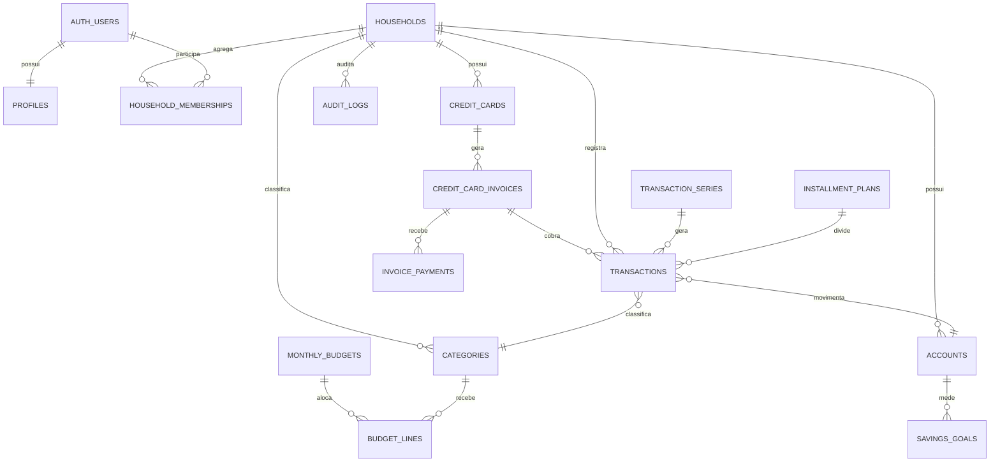

# Modelo de dados

O banco usa `household_id` como fronteira de segurança. Todas as tabelas expostas pela Data API têm RLS; funções transacionais com `security definer` fixam `search_path`, revogam acesso público e validam a membership internamente.

## Agregados e invariantes

- Família: household, memberships, convites e perfis. Convites guardam somente SHA-256, vencem em 72 horas e exigem e-mail verificado correspondente.
- Livro financeiro: lançamentos, contas, ajustes, tags, recorrências e parcelamentos. Dinheiro fica em `numeric(14,2)` no PostgreSQL e centavos inteiros no domínio TypeScript.
- Cartão: a compra consome orçamento na fatura; `invoice_payments` debita a conta. A compra individual nunca debita a conta novamente.
- Orçamento: linhas pertencem a categoria raiz. Reembolsos/estornos vinculados reduzem o custo líquido; planejados aparecem separados.
- Reserva: contribuição é transferência para conta marcada `counts_as_reserve`, reduz dinheiro livre e não consome categoria.
- Exclusão: `deleted_at/deleted_by` removem itens das agregações por 30 dias antes de eventual expurgo manual auditado.

Competência é sempre o primeiro dia do mês. `occurrence_date` preserva a data civil e `timestamptz` é reservado para eventos de auditoria/pagamento.
